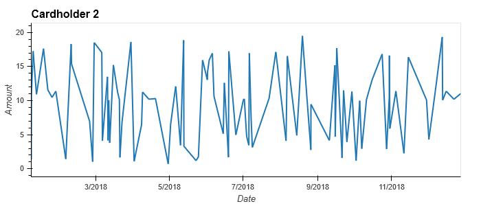
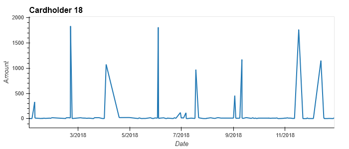
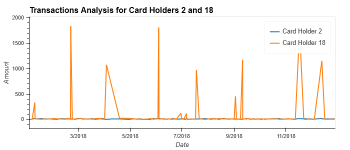
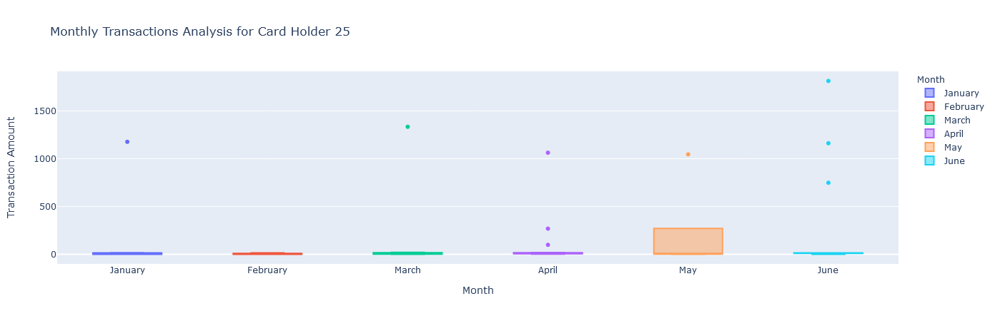

# HW7 - Suspicious Transactions

## Data Analysis - Part 1

*How can you isolate (or group) the transactions of each cardholder?*

In order to group the transactions of a single cardholder, we must consider the relationship between tables. First, the "transaction" table contains all transactions and includes only the card number used per transaction. To relate this to the actual cardholder, we must go through the "credit_card" table which contains credit card number and holder id. Using holder id, we can then link to the actual name via the "card_holder" table, which maps card number to name. This requires a join across these three tables, at which point we can search all transactions for a particular cardholder.

*Count the transactions that are less than $2.00 per cardholder*

The "small_tran_cardholder" view in queries.sql counts the transactions that are less than $2.00 per cardholder. The results show a total of 350 (out of 3500) total transactions, with Megan Price, Stephanie Dalton, and Peter Mckay having the largest amount of such transactions.

*Is there any evidence to suggest that a credit card has been hacked?*

Given the merchants in our dataset are restaurants, bars, coffee shops, pubs, and food trucks, it is not surprising to see a fair amount of small sized transactions, and at only 10% of the data, this seems reasonable. Using the "small_tran_cardnumber" query, we can analyze such transactions by card number (as opposed to card holder) and do see that 20% of card number 376027549341849's transactions are less than $2.00. This could indicate fraud, or it could just indicate this card is used by the owner to purchase his/her daily cup of joe every morning.

*What are the top 100 highest transactions made between 7:00 am and 9:00 am? Do you see any anomalous transactions that could be fraudulent?*

The "high_tran_7to9" view in queries.sql shows the 100 highest transactions made between 7 and 9 am. Of note, there are 12 transactions of $100 or more, and 8 transactions of $1,000 or more. Again, since the transactions are at restaurants and bars, it would seem odd to have these large sized transactions at this time in the morning. However, it is possible the card was used to bring in breakfast for the entire office one day.

*Is there a higher number of fraudulent transactions made during the 7 to 9 am time frame versus the rest of the day?*

To compare the 7 to 9 am time frame to the rest of the day, we use "high_tran_not7to9" and see far more larger value transactions during these other times of the day. This makes sense, as the fancy, expensive corporate dinners take place later in the evening. While there are more large value transactions, it is hard to say which are fraudulent during this later time frame. Nonetheless, with 8 transactions of $1,000 or more in the 7 to 9 am time frame, we can likely conclude there are more fraudulent transactions in this earlier window. 

It is possible more fraudulent transactions occur during the morning hours as fraudsters working in other parts of the world are operating during these times (https://stripe.com/guides/2017-global-fraud-report#fraud-by-day-and-time). Also, it may be that fraudsters figure people are on their way to work at these times and will not be checking their credit card activity until after work, later in the afternoon, meaning fraudulent transactions will not be detected for several hours. However, it is hard to make definitive conclusions given our limited dataset.

*What are the top 5 merchants prone to being hacked using small transactions?*

Using the "small_tran_merchants" view in queries.sql, we can see the merchants with the largest number of small value transactions (<$2.00) are Wood-Ramirez (with 7 such transactions), Hood-Phillips (6), and Baker Inc (6), followed by 12 merchants with 5 such transactions.

## Data Analysis - Part 2

Comparing consumption patterns between cardholders 2 and 18, we can see a clear difference in spending. While cardholder 2 averages purchases between $2 and $20 on a consistent basis, cardholder 18 makes sporadic purchases at much larger transaction values. It is possible cardholder 18 has been a victim of fraud given these sporadic large value transactions or it is just possible cardholder 18 prefers to use cash for small value transactions and plastic for the infrequent, higher value, dinners and bar tabs.

From our box plot above we can see that there quite a few outliers for cardholder 25 over the first half of 2018. Specifically, there is one outlier in January, March and May, and three in April and June. Furthermore, May appears to be a rather anomalous month, with a median purchase size of ~$6 (similar to other months), but a far larger interquartile range, with the 75th percentile at $270. This is likely caused by the fact there were only 5 purchases in the month of May, causing the $1046 outlier to greatly skew the data.

## Challenge

*Identifying outliers using standard deviation, with a cutoff at 3 std deviations, we can conclude the following:*

Cardholder 5 has the following outliers: None

Cardholder 6 has the following outliers: 2108.0, 1398.0, 1379.0, 2001.0, 1856.0

Cardholder 7 has the following outliers: 1685.0, 1072.0, 1086.0, 1449.0, 2249.0, 1296.0

## 

*Identifying outliers using interquartile ranges, with a cutoff at 1.5 * IQR, we can conclude the following:*

Cardholder 5 has the following outliers: None

Cardholder 6 has the following outliers: 1029.0, 1145.0, 389.0, 2108.0, 1398.0, 1108.0, 1379.0, 2001.0, 1856.0, 1279.0

Cardholder 7 has the following outliers: 1685.0, 445.0, 1072.0, 543.0, 1086.0, 160.0, 233.0, 1449.0, 2249.0, 1296.0

